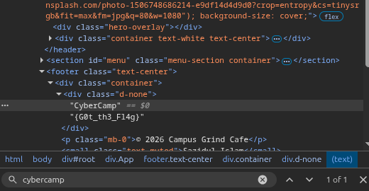
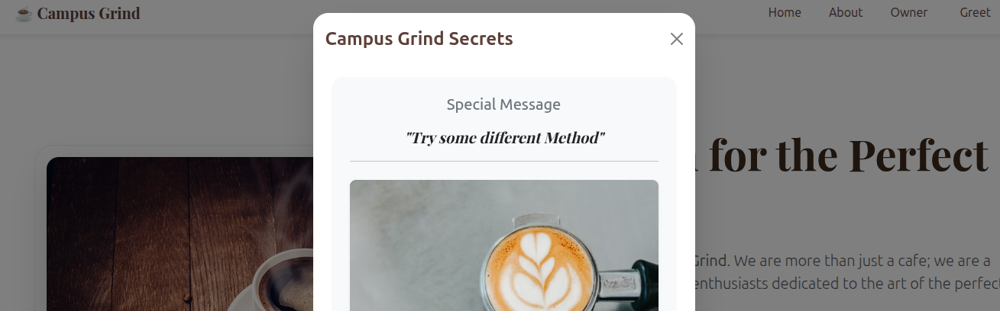
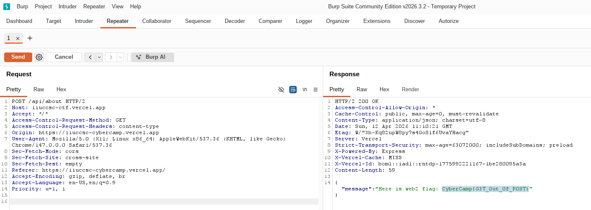
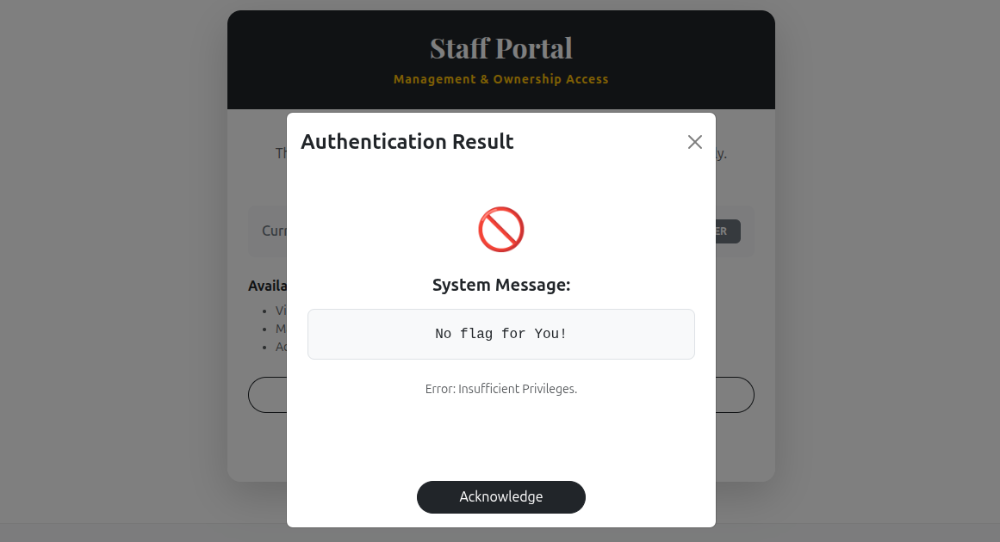
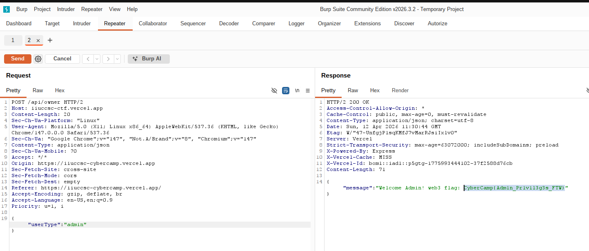
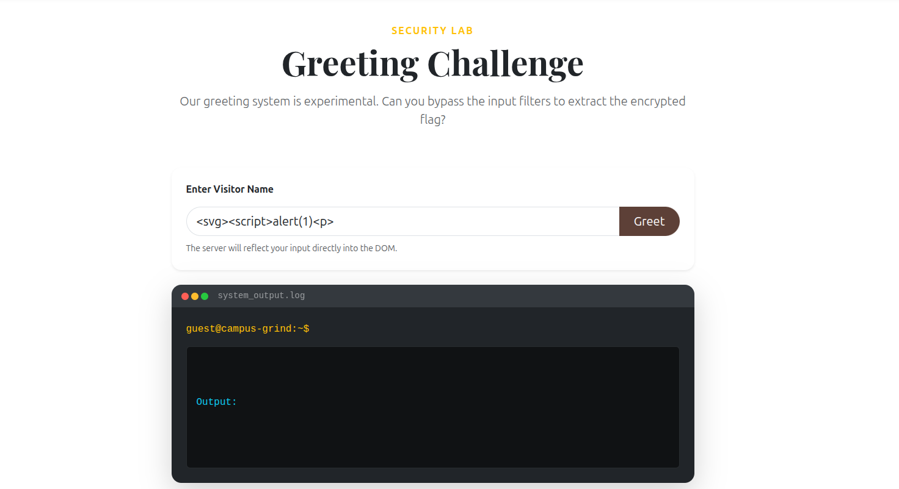
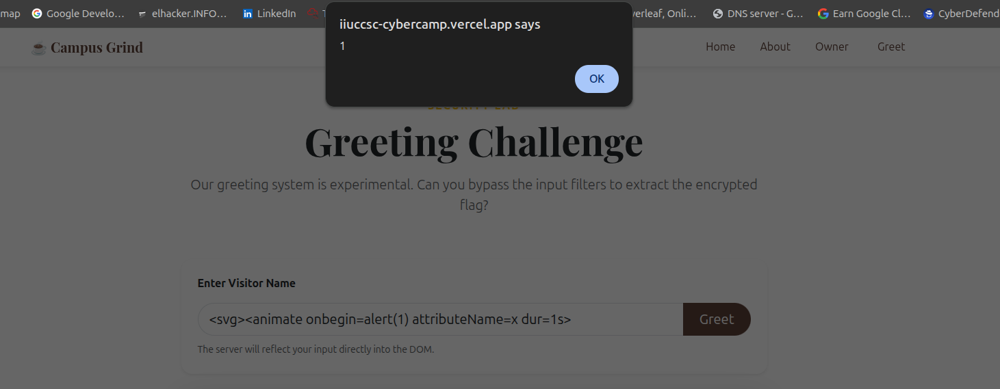
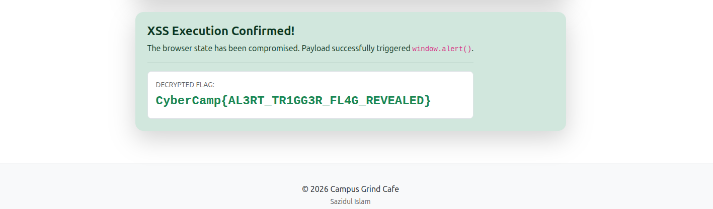

# Final Transmission - CyberCamp CTF Challenge Walkthrough

Presented by **IIUC Cyber Security Club**

## 📚 Table of Contents
- [Web Challenge 1: Hidden on the Homepage](#challenge-1-hidden-on-the-homepage-50-points)
- [Web Challenge 2: About the About Page](#challenge-2-about-the-about-page-100-points)
- [Web Challenge 3: Owner Access](#challenge-3-owner-access-200-points)
- [Web Challenge 4: Greet the Site](#challenge-4-greet-the-site-400-points)
- [Steganography Challenge 1: Ro0tKnoght](#challenge-1-ro0tknoght-50-points)
---

## Challenge 1: Hidden on the Homepage (50 Points)

### 📋 Challenge Description
The CyberCamp website looks ordinary at first glance. However, rumors suggest that the developers left behind a secret hidden on the homepage. The flag follows the format: `CyberCamp{Some_text}`

**Endpoint:** https://iiuccsc-cybercamp.vercel.app/

### 🔍 Step-by-Step Walkthrough

**Step 1:** Open the website in your browser
- Navigate to https://iiuccsc-cybercamp.vercel.app/

**Step 2:** Access the Page Source Code
- Right-click on the page and select **"View Page Source"** (or press `Ctrl+U` / `Cmd+U`)
- This will show you the HTML code of the webpage

**Step 3:** Search for the Flag
- In the page source, use `Ctrl+F` to open the Find dialog
- Search for **"CyberCamp"** or **"flag"** to locate the hidden text

**Step 4:** Extract the Flag
- You'll find the flag hidden in the HTML comments or meta tags
- The complete flag is: `CyberCamp{G0t_th3_Fl4g}`

### 📸 Screenshot


---

## Challenge 2: About the About Page (100 Points)

### 📋 Challenge Description
The About page contains much more than just information. There's a mysterious element that seems out of place. Only those curious enough to dig deeper will find the hidden surprise!

**Endpoint:** https://iiuccsc-cybercamp.vercel.app/about

### 🔍 Step-by-Step Walkthrough

**Step 1:** Navigate to the About Page
- Go to https://iiuccsc-cybercamp.vercel.app/about
- You'll see a page with information and a button labeled **"Get More Info"**

**Step 2:** Initial Attempt (The Hint)
- Click the **"Get More Info"** button
- The page displays a message: **"Try some different Method"**
- This is a cryptic hint that suggests using different HTTP methods (GET, POST, etc.)

**Step 3:** View the Challenge Page


**Step 4:** Capture the Request with Burp Suite
- Open **Burp Suite** (if you don't have it, download from https://portswigger.net/burp)
- Go to the **Proxy** tab and ensure **Intercept is On**
- In your browser, click the **"Get More Info"** button again

**Step 5:** Analyze the Request
- Burp Suite will capture the request
- You'll see it's a **GET** request to the server
- Right-click on the request and select **"Send to Repeater"**

**Step 6:** Change the HTTP Method
- In the Repeater tab, change the request method from **GET** to **POST**
- Click the **"Send"** button

**Step 7:** Get the Flag
- The server responds to the POST request with the flag
- You'll receive: `CyberCamp{G3T_0ut_0f_P0ST}`

### 📸 Screenshot


---

## Challenge 3: Owner Access (200 Points)

### 📋 Challenge Description
A page for the site owner exists, but it doesn't reveal its contents easily. Only those with keen observation and understanding of privilege escalation can see beyond the initial barrier.

**Endpoint:** https://iiuccsc-cybercamp.vercel.app/owner

### 🔍 Step-by-Step Walkthrough

**Step 1:** Navigate to the Owner Page
- Go to https://iiuccsc-cybercamp.vercel.app/owner

**Step 2:** Click the "Authenticate as Owner" Button
- You'll see a button labeled **"Authenticate as Owner"**
- Clicking it displays: **"No flag for You!"**
- This suggests that we need to modify our access privileges

**Step 3:** View the Challenge


**Step 4:** Intercept the Request with Burp Suite
- Open Burp Suite and enable Intercept in the Proxy tab
- Click the **"Authenticate as Owner"** button
- Burp Suite captures the request

**Step 5:** Send to Repeater
- Right-click the captured request and select **"Send to Repeater"**
- In the Repeater tab, examine the request body

**Step 6:** Privilege Escalation
- Look at the JSON body of the request, which contains:
  ```json
  {"userType":"guest"}
  ```
- Change **"guest"** to **"admin"**:
  ```json
  {"userType":"admin"}
  ```

**Step 7:** Send the Modified Request
- Click **"Send"** to send the modified request to the server

**Step 8:** Retrieve the Flag
- The server recognizes you as an admin and grants access
- You'll receive the flag: `CyberCamp{Adm1n_Pr1v1l3g3s_FTW}`

### 📸 Screenshot


---

## Challenge 4: Greet the Site (400 Points)

### 📋 Challenge Description
The Greet page lets visitors enter their name. The site behaves normally at first, but there's more happening under the surface. This challenge requires understanding of Cross-Site Scripting (XSS) attacks and filter bypass techniques.

**Endpoint:** https://iiuccsc-cybercamp.vercel.app/greet

### 🔍 Step-by-Step Walkthrough

**Step 1:** Navigate to the Greet Page
- Go to https://iiuccsc-cybercamp.vercel.app/greet
- You'll see an input field where you can enter a name
- The page displays a message: **"The server will reflect your input directly into the DOM"**

**Step 2:** Understand the Vulnerability
- The message is a hint that the server doesn't properly sanitize user input
- This creates an opportunity for **Cross-Site Scripting (XSS)** attacks
- However, basic XSS payloads are filtered, so we need to use advanced bypass techniques

**Step 3:** View the Challenge Page


**Step 4:** Test Basic XSS Payload (This Will Fail)
- Try entering: ``
- Result: The filter blocks this payload
- This confirms that basic payloads are filtered

**Step 5:** Use Advanced XSS Payloads
To bypass the filters, we need to use obfuscated or alternative XSS techniques. The following payload works:

```html
<svg><animate onbegin=alert(1) attributeName=x dur=1s>
```

**Step 6:** Enter the Payload
- Paste the above payload into the input field
- Press Enter or click Submit

**Step 7:** Trigger the Alert
- The browser executes the payload
- You'll see an alert box pop up
- This confirms successful XSS exploitation

**Step 8:** Additional Payloads That Work
Many other payloads can bypass the filters. For a comprehensive list, refer to:
- [PortSwigger XSS Cheat Sheet](https://portswigger.net/web-security/cross-site-scripting/cheat-sheet)

Some alternative payloads that might work:
- `<iframe src=javascript:alert(1)>`
- `<marquee onstart=alert(1)>`
- `<details open ontoggle=alert(1)>`

**Step 9:** Retrieve the Flag
- Once the XSS payload executes successfully, you'll receive the flag
- Flag: `CyberCamp{AL3RT_TR1GG3R_FL4G_REVEALED}`

### 📸 Screenshots




---

## 🎓 Learning Outcomes

By completing these challenges, you will understand:
1. **Information Disclosure** - Finding hidden data in page source code
2. **HTTP Methods** - Understanding different HTTP methods (GET, POST)
3. **Privilege Escalation** - Modifying user types to gain unauthorized access
4. **XSS Vulnerabilities** - Injecting malicious scripts and bypassing filters
5. **Web Security Tools** - Using Burp Suite for intercepting and modifying requests

## 🔐 Web Security Tips

- Always validate and sanitize user input on both client and server side
- Never trust client-side security measures alone
- Use security headers to prevent XSS attacks
- Implement proper authentication and authorization mechanisms
- Regularly audit your code for security vulnerabilities

---

## Challenge 1: Ro0tKnoght (50 Points)

### 📋 Challenge Description
The following string of text has been provided with no further explanation : 
Jrypbzr gb PlorePnzc434'f PGS rirag! Urer vf lbhe synt E3gq_g3qe_Ce3oy6z. Whfg cynpr vg orgjrra gjb pheyl oenpxref naq glcr PlorePnzc orsber vg gb trg lbhe synt. Tbbq yhpx!

### 🔍 Step-by-Step Walkthrough

**Step 1:** Put the string of text in a cypher detector/guesser.
- The text resembles a shift cypher such as Caesar's Cypher or ROTx.
- This can be confirmed using a cypher detecter/guesser such as [dcode.fr](https://www.dcode.fr/identification-chiffrement)

**Step 2:** Use an online decoder for the descovered cypher
- Use a decoder for either ROT13 or Caesar's Cypher with a shift key of 13 to retrieve the decrypted text.

**Step 3:** Retrieve the flag
- The flag is with in the decrypted text.
- Flag : CyberCamp{R3td_t3dr_Pr3bl6m}

## 🎓 Learning Outcomes

This challenge is ment to teach:
1. The use of online Cypher Detect tools to detect the type of cypher.
2. The use of online decoders.

**Good luck with the challenges! Happy hacking! 🚀**
